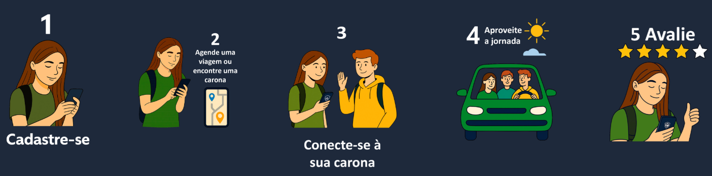
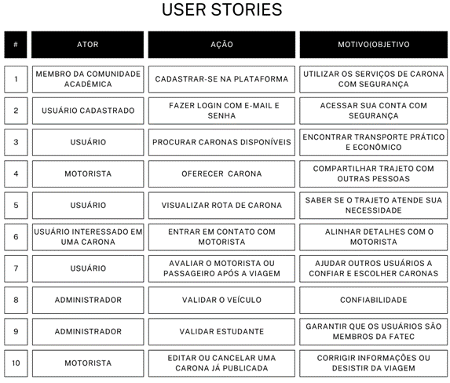

 

# 🚗 FaculRide | Sistema de Caronas Acadêmicas

Projeto de caronas acadêmicas desenvolvido pelos alunos da **FATEC Votorantim**, promovendo economia, segurança e sustentabilidade no deslocamento diário.  

[Sobre](#-sobre-o-projeto) | [Backlogs & User Stories](#-backlogs--user-stories) | [Protótipo & Documentação](#-documentação) | [Equipe](#-equipe)

---

## 💡 Sobre o Projeto

O **FaculRide** é uma plataforma inovadora de caronas criada especialmente para a comunidade acadêmica, com o propósito de reduzir a emissão de carbono e facilitar o deslocamento diário de estudantes, professores e funcionários.  
Mais do que um site, o FaculRide é um projeto sustentável que reforça o compromisso ambiental da instituição.

Com um sistema de compartilhamento de viagens, o FaculRide ajuda a diminuir o estresse do trânsito, reduzir custos e promover a integração social dentro da faculdade.  
Pensado para a segurança e conveniência dos usuários, oferece funcionalidades como cadastro verificado e agendamento flexível de caronas, proporcionando uma experiência prática e confiável.

O **FaculRide** é mais do que uma solução de transporte: é uma iniciativa que conecta pessoas, promove a sustentabilidade e transforma o dia a dia acadêmico.

## 🌱 Sustentabilidade

Nosso projeto é comprometido com o desenvolvimento sustentável.  
Atendemos às metas da **ODS 11** (Cidades e Comunidades Sustentáveis) e da **ODS 13** (Ação Contra a Mudança Global do Clima), promovendo uma mobilidade urbana mais consciente e responsável.

## 🚗 Como Funciona

Cadastre-se, encontre ou ofereça uma carona, conecte-se e combine os detalhes e aproveite sua viagem rumo ao futuro!

## 🧪 Tecnologias Utilizadas

→ [Voltar ao topo](#topo)

---

## 📌 Backlogs & User Stories

Durante o desenvolvimento do projeto **FaculRide**, utilizamos a metodologia ágil **Scrum**, com o objetivo de garantir entregas iterativas, incrementais e com valor contínuo ao usuário final. O projeto foi dividido em **5 Sprints**, cada uma com seus respectivos objetivos e entregáveis.

### 🔁 Metodologia Scrum Aplicada

> O Scrum foi escolhido por sua abordagem flexível e adaptável, permitindo respostas rápidas a mudanças e feedbacks contínuos ao longo do ciclo de desenvolvimento.

### 📅 Sprints do Projeto

| Sprint | Período         | Principais Entregas                                                                 |
|--------|------------------|-------------------------------------------------------------------------------------|
| 01     | Início do projeto | Estruturação do sistema, cadastro e autenticação de usuários, acessibilidade inicial |
| 02     | Iteração Visual   | Melhorias visuais e funcionais, integração com Google Maps, refinamento da interface |
| 03     | Integração Total  | Integração dos fluxos Angular, back-end e banco (PostgreSQL), testes de integração   |
| 04     | Qualidade Final   | Testes de acessibilidade e usabilidade, ajustes de desempenho                       |
| 05     | Entrega Final     | Documentação técnica, manuais, deploy final no Render                               |

### 🧾 User Stories

## ✅ Requisitos Funcionais

| Nº Requisito Funcional | Nome              | Descrição                                                             |
|------------------------|-------------------|-----------------------------------------------------------------------|
| RF001                  | Login             | Fazer Login Intranet                                                  |
| RF002                  | Gerenciar Usuário | Consultar, cadastrar, alterar ou excluir usuário do site              |
| RF003                  | Chamar Carona     | Solicitar, passageiro solicita a sua carona ao motorista              |
| RF004                  | Oferecer Carona   | Oferecer carona, motorista disponibiliza a sua carona ao passageiro   |
| RF005                  | Procurar Carona   | Pesquisar e visualizar lista de motoristas disponíveis                |
| RF006                  | Geolocalização    | Rastrear localização dos passageiros e motoristas                     |
| RF007                  | Notificações      | Enviar notificações via e-mail ou pelo site para informar os usuários |
| RF008                  | Avaliação         | Implementar um sistema de avaliação de 1 a 5 para os usuários         |
| RF009                  | Comentários       | Comentários relacionados aos usuários                                 |

## 🚫 Requisitos Não Funcionais

| Nº Requisito Não Funcional | Nome              | Descrição                                                                 |
|----------------------------|-------------------|---------------------------------------------------------------------------|
| RNF001                     | Banco de dados    | Utilização de Banco de dados SQL Server                                   |
| RNF002                     | HTML              | Utilizar linguagem HTML                                                   |
| RNF003                     | Segurança         | O sistema deve ser protegido contra acessos não autorizados              |
| RNF004                     | Escalabilidade    | O sistema deve ser capaz de aumentar ou diminuir sua capacidade          |
| RNF005                     | Velocidade e Eficiência | O sistema deve ser capaz de escalar o tráfego conforme necessário        |
| RNF006                     | Disponibilidade   | O sistema deve estar disponível 24h por dia, 7 dias por semana           |
| RNF007                     | Usabilidade       | Interface intuitiva e fácil de usar, mesmo para iniciantes               |
| RNF008                     | Confiabilidade    | O sistema deve ser robusto e resistente a falhas                         |
| RNF009                     | Portabilidade     | Deve funcionar em diversos dispositivos e sistemas operacionais          |
| RNF010                     | Manutenibilidade  | Código organizado e documentado para facilitar atualizações futuras      |

→ [Voltar ao topo](#topo)

## 🗂️ Documentação

- 📄 [Projeto IHC (PDF)](docs/Projeto%20IHC%20-%20Grupo%20-WI%20(FaculRide).pdf)
- 📄 [Projeto Gestão Ágil (PDF)](docs/Projeto%20Gestão%20Agil%20-%20Grupo%20-WI%20(FaculRide).pdf)

---

## 👥 Equipe

> *Breno Jose Da Silva*  
> Fatec Votorantim – Desenvolvimento de Software Multiplataforma  
> 3º Semestre – 2024/2025

> *Gabriel Ribeiro Correa*  
> Fatec Votorantim – Desenvolvimento de Software Multiplataforma  
> 3º Semestre – 2024/2025

> *Herivelton Henrique Gonçalves*  
> Fatec Votorantim – Desenvolvimento de Software Multiplataforma  
> 3º Semestre – 2024/2025

> *Wendel Augusto Lopes Vasco*  
> Fatec Votorantim – Desenvolvimento de Software Multiplataforma  
> 3º Semestre – 2024/2025

---

Se quiser que eu continue com a parte dos **backlogs**, **protótipo**, **sprints**, **links de deploy** etc., posso seguir com base nos outros arquivos! Deseja isso agora?

